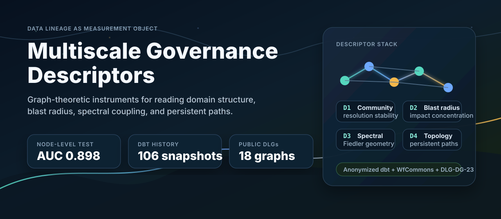
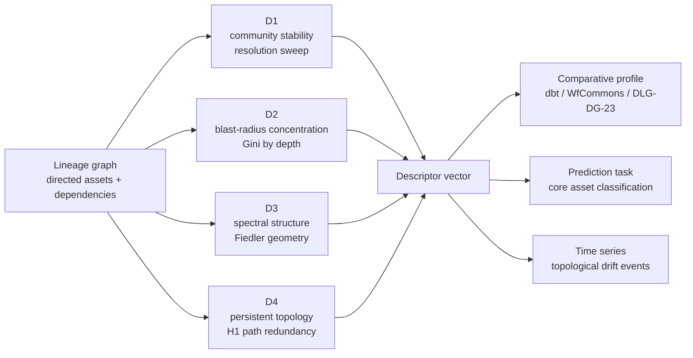

<p align="center">
  
</p>

<h1 align="center">Multiscale Governance Descriptors</h1>

<p align="center">
  <strong>Graph descriptors for reading governance-relevant structure in data lineage systems.</strong>
</p>

<p align="center">
  <a href="https://github.com/mhdk1602/multiscale-governance-descriptors/releases/tag/v2.1.0"></a>
  <a href="https://doi.org/10.5281/zenodo.20209148"></a>
  
  
</p>

<p align="center">
  <a href="#signal">Signal</a> /
  <a href="#active-study">Active Study</a> /
  <a href="#descriptor-stack">Descriptor Stack</a> /
  <a href="#quick-start">Quick Start</a> /
  <a href="#reproducibility">Reproducibility</a> /
  <a href="#citation">Citation</a>
</p>

This repository asks a narrow research question:

> When governance metadata is missing, sparse, or too sensitive to publish, how much governance signal is already present in the topology of the lineage graph?

The answer is mostly negative, and the negative result is the contribution. A strong-looking domain-level correlation between a spectral-gap descriptor and documentation rate (Spearman `rho = -0.71`) collapses under layer-stratified permutation (`p = 1.000`): the signal is between-layer architecture (source / staging / mart), not within-layer governance. Node-level core-asset prediction does reach mean AUC `0.898 +/- 0.098` on the DLG-DG-23 graphs, but that **reproduces** the centrality result of Chen et al. (2023) on the same data. Phase five tests ordinary centrality and reachability features; it does not test whether D1-D4 add incremental node-level information. The defensible finding is therefore deflationary: lineage topology under-determines governance maturity, and the portable contribution is the inference protocol that proves it (`src/governance_descriptors/inference_protocol.py`).

## Signal

| Finding | Evidence | Where |
|---|---:|---|
| **Topology under-determines governance maturity** (headline) | D3 vs doc_rate `rho = -0.71` collapses under layer-stratified permutation, `p = 1.000` | `artifacts/phase_3/exp6_summary.json` |
| Core asset prediction reproduces Chen et al. (2023) centrality; D1-D4 were not evaluated in that model | LR AUC `0.898 +/- 0.098`, random baseline `0.546` | `artifacts/phase_5/` |
| Shared-ID leakage check | AUC remains `0.891` after removing 3 repeated core IDs | `artifacts/phase_5/exp7_hardening.json` |
| Production dbt descriptor profile | `223` nodes, `263` edges, `26` anonymized domains | `artifacts/phase_3/` |
| Longitudinal dbt drift | `106` snapshots across `9.0` project-years, `44` large drift events | `artifacts/phase_4/summary_refined.json` |
| Cross-organisation caution | Cal-ITP and Mattermost do not reproduce the single-organisation D3 correlation | `artifacts/phase_3/exp6_summary.json` |
| Synthetic scale check | Multiscale descriptors reach AUC `0.935 +/- 0.113`; simpler baselines reach `1.000` | `artifacts/phase_3/exp4_grouped_cv.json` |

The core boundary condition:

> Topology-based governance inference works best at node granularity with curated expert labels. It is weaker at domain granularity when the target is aggregated governance metadata.

## Active Study

The next study changes the unit and the outcome rather than searching the same
small cross-section for another correlation:

> Do exact lineage changes improve prediction of post-merge adverse events, and
> is changed blast-radius risk weaker when tests, contracts, ownership, and
> freshness controls are present?

Each observation is a merged change with exact before and after dbt manifests.
The implementation preserves typed dependencies, measures control coverage,
separates cheap graph-diff baselines from multiscale features, and refuses to
evaluate labels that have not completed descriptor-blind adjudication.

| Component | Location |
|---|---|
| Preregistered protocol | `research/governance_change_risk/PREREGISTRATION.md` |
| Primary-source evidence map | `research/governance_change_risk/LITERATURE_POSITIONING.md` |
| Consecutive cohort and confirmation firewall | `research/governance_change_risk/COHORT_COLLECTION_PLAN.md` |
| Adverse-event codebook | `research/governance_change_risk/ANNOTATION_CODEBOOK.md` |
| Manifest-pair contract | `research/governance_change_risk/DATA_CONTRACT.md` |
| Public feasibility pass | `research/governance_change_risk/PILOT_FEASIBILITY_2026-07-13.md` |
| Version 2 feature audit | `research/governance_change_risk/pilot_feature_rerun_2026-07-13.json` |
| Extraction and feature code | `src/governance_descriptors/change_risk/` |
| End-to-end tests | `tests/test_change_risk.py` |

```bash
governance-change-risk freeze-cohort --candidates candidates.jsonl \
  --protocol-version 0.3 --output cohort-frozen.json
governance-change-risk build --registry pairs.jsonl --output change-risk.csv
governance-change-risk evaluate --dataset change-risk.csv --output evaluation.json
```

Feature spec v2 preserves the four primary global-graph model comparisons and
adds a separately named, pre-outcome `change_geometry__` family. It measures
directed ball growth, saturation, affected-subgraph conductance and cycle rank,
and community-boundary crossing around the changed models. The scales were
fixed before consecutive outcome sampling. The repair-linked Cal-ITP case that
motivated the amendment cannot enter confirmation.

This work is a separate confirmatory program. The existing paper remains the
negative-result and inference-protocol record.

## Descriptor Stack



| Family | Question | Representative outputs |
|---|---|---|
| `D1` community stability | Are domain boundaries stable across Louvain resolution? | CSI, fragmentation onset, modularity variance |
| `D2` blast radius | Is downstream impact concentrated in a small set of assets? | Gini curve, top-k downstream stability |
| `D3` spectral structure | How tightly coupled is the lineage skeleton? | algebraic connectivity, spectral gap, Fiedler bimodality, entropy |
| `D4` persistent topology | Are there persistent alternate paths through the graph? | H1 bars, total persistence, persistence entropy |

## Quick Start

```bash
git clone https://github.com/mhdk1602/multiscale-governance-descriptors.git
cd multiscale-governance-descriptors
python -m venv .venv
source .venv/bin/activate
pip install -r requirements.txt
pip install -e .
```

Compute the descriptor stack for a small lineage DAG:

```python
import networkx as nx
from governance_descriptors import (
    resolution_sweep,
    community_stability_index,
    concentration_profile,
    spectral_descriptors,
    topological_descriptors,
)

g = nx.DiGraph()
g.add_edges_from([
    ("raw_orders", "stg_orders"),
    ("raw_customers", "stg_customers"),
    ("stg_orders", "int_customer_orders"),
    ("stg_customers", "int_customer_orders"),
    ("int_customer_orders", "mart_customer_health"),
])

sweep = resolution_sweep(g, n_steps=12, seed=42)

profile = {
    "D1_csi": community_stability_index(sweep),
    "D2_blast_radius": concentration_profile(g, max_depth=3),
    "D3_spectral": spectral_descriptors(g),
    "D4_topology": topological_descriptors(g),
}

print(profile)
```

## Reproducibility

The repo is organized around executable experiments and saved result artifacts.

| Path | Contents |
|---|---|
| `src/governance_descriptors/` | Python implementation of D1-D4 descriptors and statistical helpers |
| `experiments/phase_3/` | real-data validation, null models, seed checks, cross-organisation comparison |
| `experiments/phase_4/` | longitudinal dbt topology drift over public project histories |
| `experiments/phase_5/` | DLG-DG-23 node-level core-asset prediction |
| `research/governance_change_risk/` | preregistration, annotation codebook, and manifest-pair contract for the PR-level successor study |
| `src/governance_descriptors/change_risk/` | exact manifest extraction, graph-delta features, collection, and held-out evaluation |
| `data/` | anonymized dbt metadata plus public external graph datasets |
| `paper/` | preprint source, references, submission materials |
| `artifacts/` | JSON, CSV, and Markdown outputs used by the paper |

Run the strongest current result:

```bash
python experiments/phase_5/exp_dlg_core_asset_prediction.py
```

Run the longitudinal dbt drift analysis:

```bash
python experiments/phase_4/exp_longitudinal_dbt.py
```

The production dbt graph is anonymized with HMAC-SHA256. The repository does not expose SQL, column names, business identifiers, or private lineage semantics.

## Empirical Scope

This is research code, not a governance scoring product. The project separates three claims:

1. Production data lineage graphs have measurable structural signatures.
2. Some graph descriptors correlate with governance metadata in a single anonymized dbt case, but those domain-level correlations are sensitive to layer structure.
3. Node-level topological features predict curated expert core-asset labels across six DLG-DG-23 graphs with materially better-than-random AUC.

That distinction matters. The methods are useful when the unit of analysis and label quality match the graph signal.

## Citation

```bibtex
@misc{hari2026multiscale,
  title  = {Multiscale Structural Descriptors for Data Governance Graph Assessment},
  author = {Dineshkumar Malempati Hari},
  year   = {2026},
  doi    = {10.5281/zenodo.20209148},
  url    = {https://github.com/mhdk1602/multiscale-governance-descriptors}
}
```

## Repository Status

- Latest release: `v2.1.0`
- Archive DOI: `10.5281/zenodo.20209148`
- Primary language: Python
- Main dependencies: NetworkX, NumPy, SciPy, pandas, GUDHI, scikit-learn
